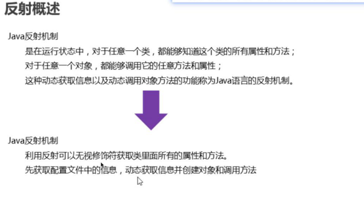

## 三要素

IP地址, 端口, 协议

IP: 在网络中一台设备的地址

- IPv4
- IPv6

端口

​	区分设备中的一个网络程序

协议: 传输的规则

- UDP : 面向无链接的传输协议
  - 不安全, 不可靠, 效率高( 电话会议 )
  - 数据打包发送
  - 64kb内
- TCP : 面向有链接的传输协议
  - 安全, 可靠,  效率相对较低
  - 得到一个通道
  - 大量数据
- ...

UDP

- 单播
- 组播
- 广播

TCP

特点: 

1. 先建立连接
2. 先得到通道
3. 大量数据

- 单播
  - 客户端
    - 创建tcp的socket  socket(目标IP, 端口)
    - 得到通道
    - 写入数据
  - 服务端
    - 创建服务端
    - 得到通道
    - 写入数据
    - 关闭socket
- 组播
- 广播

>
>
>
>
>* 加载
>  * 通过类的全限定类名获取此类的二进制字节流
>  * 将字节流所代表的 静态结构转 化为方法区的 运行时数据结构
>  * 在内存中生产一个代表这个类的 **java.lang.Class** 对象,作为方法去这个类的各种数据访问的访问入口
>* 链接
>  * 验证
>    * 确保class文件的字节流中的信息扶额和虚拟机要求
>      * 包括文件格式验证(CA EF BA BE),元数据验证,字节码验证,符号引用验证
>  * 准备
>    * 为类变量分配内存,并设置该类变量的默认初始值,即0
>    * 不包含用final修饰的statcic,因为final在编译的时候就会分配了,准备阶段会显示初始化
>    * 这里不会为实力变量初始化
>  * 解析
>    * 将 常量池 中的 符号引用 转化为 直接引用 的过程
>    * 符号引用
>      *  就是一组符号来描述所引用的目标 ,
>      * 符号常量的字面量形式明确的定义在<Java虚拟机规范>的class文件格式中; 
>      * 直接引用就是直接指向目标的指针相对偏移量或一个简介定位到目标的句柄
>    * 解析动作主要针对接口,字段,接口方法,方法类型等
>* 初始化
>  * 静态变量初始化, 初始化其他资源
>  * 就是执行类构造器方法`<clinit>()`的过程
>  * 此方法是Javac编译器自动收集类中所有的类变量的`赋值动作`和`静态代码`中的语句合并而来
>  * 指令是按照源文件中的顺序来执行的
>  * 不同于类的构造器`<clini M会保证父类的`clinit()`执行前,父类的`<clinit>()`已经执行完毕
>  * 必须保证`<clinit>()`在*多线程*下被同步加锁

反射是什么样的技术

